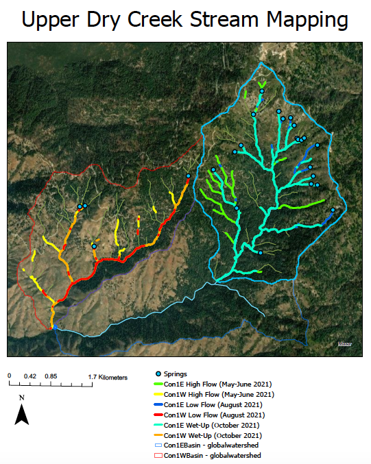
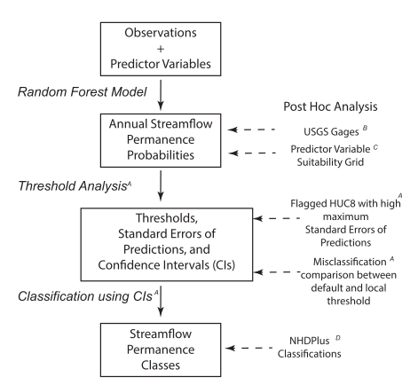
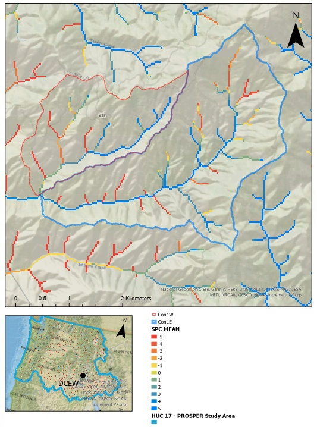

 Elizabeth Crowther 

 GEOS 518 

 Term Project 

 12-16-2021

# Testing the PROSPER Model in a paired spring fed vs non-spring fed catchment experiment

## Introduction:

Up until the last decade, intermittent streams have been continually underrepresented in the hydrologic literature. Recently, one of the main research topics in surface hydrology has been describing and quantifying the mechanism that drives non-perennial stream behavior (e.g., Fritz et al., 2008; Godsey & Kirshner, 2014; Whiting & Godsey, 2016, Lovill et al., 2018). Geomorphic conditions, such as topography (Lovill et al., 2018; Prancevic & Kirchner, 2019), hydraulic gradients (Ward et al., 2012), and groundwater residence time (Warix et al., 2021), are seen as predictors of stream intermittency timing and duration. Based on these geomorphic controls, hydrologists have been developing models to predict stream intermittency where flow monitoring is scarce (Ward et al. 2018, Jaeger et al. 2019). Specifically, the Probability of Streamflow Permanence (PROSPER) Model was created to predict stream presence/absence from physiographic and climatic conditions (Jaeger et al. 2019). Yet, spring locations from the National Hydrologic Dataset were not included in their model (Jaeger et al., 2019). Springs and stable flow heads in headwater streams have been shown to create more stable flow networks in mountainous headwater catchments (Whiting & Godsey, 2016). Springs are not consistent in nature and can have varying degrees of influence on a streamflow stability (Springer & Stevens, 2009). Therefore, quantifying their influence on stream intermittency has been a challenge for researchers.

This report will propose future work that I will conduct for my graduate thesis. I hypothesize that springs increase headwater stream network stability throughout a drying season. To achieve this goal, I have collected stream connection and length data from a pair of headwater catchments within the Dry Creek Experimental Watershed (Figure 1). In Con1E (Figure 1), significantly more springs and stable flowheads were identified (19 springs) in comparison to Con1W (3 springs). To assess how well these catchments can be predicted, active streamflow location data will then be compared to the presence/absence predictions for these streams from the PROSPER Model. Since springs have less influence in Con1W (spring limited) I predict the PROSPER Model will be more accurate in Con1W. The opposite is true for Con1E, since the majority of tributaries are sourced from springs/stable flowheads. 

    

    
    
| <b>Fig.1 - </b> Con1E (blue) and Con1W (red) stream network maps. Both catchments are headwaters of the Dry Creek Experimental Watershed ([Dry Creek Data, Boise State University](https://www.boisestate.edu/drycreek/dry-creek-data/)). Flow start/stop data was collected through ArcGIS Field Maps then projected to stream networks using a 5m DEM for the Dry Creek Experimental Watershed.

## Model Description

As previously stated, the PROSPER Model was created by the United States Geological Survey (USGS) to classify stream permanence classifications for the Pacific Northwest (Jaeger et al. 2019). Specifically, Jaeger et al., (2019) developed the model for Hydrologic Unit Code 17 (HUC17) with streams mapped through the NHDPlus (National Hydrography Dataset). The purpose of PROSPER was to create a fine resolution stream dataset to extend stream flow presence predictions to areas lacking observational data (Jaeger et al. 2019). PROSPER uses a combination of observational wet/dry points (McShane et al., 2017) and geospatial analysis to classify streamflow presence probabilities for 30 m reach sections. Analysis for the model is run through a three-tiered process: random forest model, threshold analysis, and classification of stream permanence from confidence intervals (CIs) (Figure 2, Jaeger et al., 2019). PROSPER employed the pre-existing randomForest package in R adjusted variables within the code. The number of decision trees built was set to 500 and the number of predictor variables selected to split data was set to 5 (Liaw & Wiener, 2002; Jaeger et al., 2019). The climatic and physical predictor variables were run through each classification tree to produce a grid of stream permanence probabilities. Probability class thresholds were then adjusted to fit regional conditions. This will be discussed further in the Data Needs section of this report. Validation for PROSPER stream permanence predictions were then validated through a series of statistical tests. This included comparing predictions to USGS gauge streamflow statistics, evaluating how well the observational data (McShane et al., 2017) represented the study area, and a comparison to the NHDplus perennial/non-perennial classifications (Jaeger et al., 2019). 

    
Although the PROSPER model has gained regard for creating a continuous stream presence/absence dataset, it has also fostered some questions on intermittent stream misclassification. One being PROSPER’s validation process and observational data. Intermittent and headwater streams have been significantly underrepresented in national datasets like USGS stream gauges and NHDplus (Jaeger et al., 2021; Fritz et al., 2013), which the model uses in it’s calibration and validation process. PROSPER also overpredicted dry for spring fed streams in arid environments (Jaeger et al., 2019). With both the NHD as a model input and the lack of data on intermittent streams, it can be expected that PROSPER’s accuracy could falter for streams categorized as headwater, spring-fed, and/or intermittent. Overall, the PROSPER model correctly predicted 80% of streams as wet/dry. Yet, there is still a call for improving the observational data and more predictor variables to create a more representative model (Jaeger et al., 2019; Jaeger et al., 2021). 
    
    
Since this is a relatively new model, not many studies have been published using this for water management or model validation. Many references to PROSPER have been used to justify background on other research regarding intermittent streams (Fritz et al., 2020, Zimmer et al., 2020; Shanafield et al. 2021), other researchers have created models with similar goals to PROSPER by predicting stream permanence in other environments. Pate et al., (2020)  introduced a stream permanence model that also used the random forest model method as well as using finding from the PROSPER model to improve prediction accuracy. Currently, the PROSPER model is available to use via USGS StreamStats and downloadable yearly stream prediction class (SPC) data. Easily accessible dataset like PROSPER act as a convenient tool for future work on intermittent stream behavior as well as provide insight for water resource management decisions. 

## Data Needs: 

The PROSPER Model used GIS-derived products as well as field observations (wet/dry) as data inputs. 24,316 stream flow status data points in the Pacific Northwest were compiled from 1977-2016 and transformed into a binary dataset of just ‘wet/dry’ (McShane et al., 2017). Wet was classified if surface water was seen after July 1, or the driest time of year for the mountain west, while dry classifications could occur at any time of the year (Jaeger et al., 2019). Along with on-the-ground observations, 257 climatic and 35 physical predictor variables were included to project presence and absence in areas with no in-situ data (Jaeger et al., 2019). This model also requires continuous data (monthly and annual), which only existed from 2004-2016 for all of the climatic predictor variables (Jaeger et al., 2019). Climatic predictors included mean daily maximum climatic temperature, annual precipitation, snow water equivalent, and evapotranspiration. Physiographic predictors included land use cover, topography, soils, and permeability baseflow index (Jaeger et al., 2019). Although many input datasets were calculated from national datasets and aerial imagery, permeability required calculation based off of the permeability characteristics of surficial geology. This is also why surficial geology was not included as a predictor variable (Jaeger et al., 2019). The predictor variables were then rasterized by using the NHDPlus flow direction grids to describe the influence of the predictor variable on the stream channel grid cell. These are referred to as Continuous Parameter Grids (CPGs, Sando et al., 2018 [1]). The combined field observations and CPGs were then used in a random forest model in R (Breiman, 2001) to create stream permanence probabilities (Jaeger et al., 2019). The probabilities for each stream channel grid cell (30 m resolutions) were then classified to wet or dry using a localized threshold analysis with associated statistical confidence values (Jaeger et al., 2019). The data outputs were calculated in terms of how statistically similar the predictor variable conditions were to the observed data of wet or dry. The threshold for wet channel cells was greater than 0.5 probability, where dry was less than 0.5 probability (Jaeger et al., 2019). Beyond the initial examination of PROSPER (Jaeger et al., 2019), there was a call for more field observations to not only add more observational data to the PROSPER model, but to also create a publically available data set of intermittent stream locations and identifiers throughout the Pacific Northwest (Jaeger et al., 2021). 

| <b>Fig.2 - </b> Conceptual Map of PROSPER anaylsis and classification process. Created by Jaeger et al (2019). https://doi.org/10.1016/j.hydroa.2018.100005|

## Calibration: 
For the proposed project, the PROSPER model will not need calibration or manipulation to fit the study area since there is already a publicly available dataset pre-created. The work proposed will work as validation and statistical test of the accuracy of PROSPER in the Dry Creek headwater catchments. The PROSPER channel grid cells are based on the NDHPlus stream data sets (Jaeger et al., 2019). As previously stated, each cell contains a classification of wet or dry with associated probabilities. These would be the target variables (or outputs) I will be assessing. The observational data needed to test the accuracy of these predictions would be a set of in-field stream mapping along the PROSPER streams. The wet classification for the observational data used in the model was classified based on flowing observations past July 1 (Jaeger et al., 2019). So therefore, wet/dry stream data post-July 1st is needed to stay consistent with previous point classifications. The PROSPER dataset is separated into annual predictions as well as mean predictions for all available years (2004-2016). To calibrate based on similar climatic conditions a water year most similar to the year of stream mapping should be used for more accurate model validation. Stream permanence data collected in the field should be altered to fit the NHDplus streamlines as well as the 30 m resolution of the model. The flow data that was collected in 2021 was analyzed at a 10m resolution from the accuracy of the GPS systems used. The stream line data will then need to be converted to a lower resolution of 30 m. The data will then be converted to binary point data of wet/dry at each 30 m increment. The streams can then be converted to a RASTER to fit the output of the PROSPER model. Accuracy will be calculated through supervised classification learning correctly and incorrectly predicted wet/dry values. 

    

| <b>Fig.3 - </b> PROSPER model SPCs stream data for the Con1E and Con1W catchment. Map of Dry Creek Expermimental Watershed relative to the PROSPER Study Area|
     

## Numerical Experimental Design:

To reiterate, the goal of the proposed analysis is to test the accuracy of the wet/dry predictions from the PROSPER model against in-field stream data from paired headwater catchments. Although other spatial analysis is needed (e.g. topography, slope, runoff ratios), a primary difference between the Con1W and Con1E catchments is the number of stable flowheads and springs (Figure 1). Predictor variable inputs for the PROSPER model also take into account the physical and climatic changes between the study areas through their many predictor variables, which allows for an isolated analysis of the missing predictor variable, springs. Even though they are smaller headwater catchments, Con1W (3.88 km2) and Con1E (4.72 km2)  are ideal catchment candidates for validating PROSPER since the original observed data were primarily focused on small streams (Jaeger et al., 2019). Although this accuracy analysis is not based on published research, the accuracy tests for this work will follow similar accuracy testing to K.F. Halen (2021) dissertation work testing the accuracy of the Watershed Erosion Prediction Project (WEPP) model (Halen, 2021). Since the PROSPER model calculates a wet/dry prediction on an annual timeline, our steam spatial data will also act as an annual representation of that water year. For both the Con1E and Con1W basin, stream network data has been gathered for 2021. Stream mapping was modeled from a similar methodology set by Godsey & Kirchner (2014) and Whiting & Godsey (2016). To represent high - low streamflow conditions, mapping was conducted in May, August, and October of 2021. For the purpose of this experiment, the August stream mapping data will be used since the PROSPER model identified their observational wet streams if it was marked wet after July 1 (McShane et al., 2017; Jaeger et al., 2019). 
    
    
Accuracy analysis will be conducted through a supervised classification analysis, to assess how well the PROSPER agreed within observed data. False positives and negatives will be redefined as false wet classifications and false dry classifications. Type I errors (false positives) will be streams that were observed dry but predicted to be wet, while Type II errors (false negatives) will be wet streams that PROSPER modeled as dry. The more correctly identified channel cells, the more agreement the model has to the observational stream mapping data.
    
    
Creating this accuracy metric from the PROSPER model will further enhance knowledge on how springs influence stream permanence. With springs not being one of the many predictor variables within the model, we can also assess if the model would benefit from the possible inclusion of a spring dataset. I hypothesize that the PROSPER model will statistically agree more with the catchment lacking springs (Con1W) since the model did not include springs as a predictor variable for stream permanence (Jaeger et al., 2019). With that logic, I also expect PROSPER to be more inaccurate in the catchment with more springs (Con1E). The analysis outlined  in this report should not only add to the validation tests of the PROSPER model, but also statistically quantify the influence of springs on stream permanence prediction. 

	

## References

Breiman, L. (2001). Random forests. Mach. Learn. 45 (1), 5–32. 
    
Fritz, K. M., Johnson, B. R., & Walters, D. M. (2008). Physical indicators of hydrologic permanence in forested headwater streams. Journal of the North American Benthological Society, 27(3), 690–704. https://doi.org/10.1899/07-117.1
    
    
Godsey, S. E., & Kirchner, J. W. (2014). Dynamic, discontinuous stream networks: Hydrologically driven variations in active drainage density, flowing channels and stream order. Hydrological Processes, 28(23), 5791–5803. https://doi.org/10.1002/hyp.10310

Hafen, K. C. (2021). Dynamic stream permanence estimates at regional and local extents (Order No. 28323357). Available from ProQuest Dissertations & Theses Global. (2544860606). Retrieved from https://libproxy.boisestate.edu/login?url=https://www.proquest.com/dissertations-theses/dynamic-stream-permanence-estimates-at-regional/docview/2544860606/se-2?accountid=9649
    
Liaw, A., Wiener, M., (2002). Classification and regression by Random Forest. R News 2 (3), 18–22.
   
Lovill, S. M., Hahm, W. J., & Dietrich, W. E. (2018). Drainage from the Critical Zone: Lithologic Controls on the Persistence and Spatial Extent of Wetted Channels during the Summer Dry Season. Water Resources Research, 54(8), 5702–5726. https://doi.org/10.1029/2017WR021903

McShane, R.R., Sando, R., Hockman-Wert D.P. (2017). Streamflow Observation Points in the Pacific Northwest, 1977-2016: U.S. Geological Survey data release, https://doi.org/10.5066/F7BV7FSP.
    
Prancevic, J. P., & Kirchner, J. W. (2019). Topographic Controls on the Extension and Retraction of Flowing Streams, 2084–2092. https://doi.org/10.1029/2018GL081799
    
Sando, R., Hockman-Wert, D.P., (2018). Probability of Streamflow Permanence (PROSPER) Model Output Layers: U.S. Geological Survey data release, https://doi.org/10.5066/F77M0754.

Sando, R., Olsen, T.D., Kaiser, K.E., Haluska, T., Hockman-Wert, D.P. (2018). In: Probability of Streamflow Permanence (PROSPER) Continuous Parameter Grids (CPGs). U.S. Geological Survey data release. https://doi.org/10.5066/F7CC0ZXH.
  
    
Shanafield, M., Bourke, S., Zimmer, M., & Costigan, K. H. (2021). Overview of the hydrology of non-perennial rivers and streams. Wiley Interdisciplinary Reviews: Water, (July 2020), 1–25. https://doi.org/10.1002/wat2.1504
    
Whiting, J. A., & Godsey, S. E. (2016). Discontinuous headwater stream networks with stable flowheads, Salmon River basin, Idaho. Hydrological Processes, 30(13), 2305–2316. https://doi.org/10.1002/hyp.10790
    
Zimmer, M. A., Bailey, S. W., Mcguire, K. J., & Bullen, T. D. (2013). Fine scale variations of surface water chemistry in an ephemeral to perennial drainage network. Hydrological Processes, 27(24), 3438–3451. https://doi.org/10.1002/hyp.9449
    
    